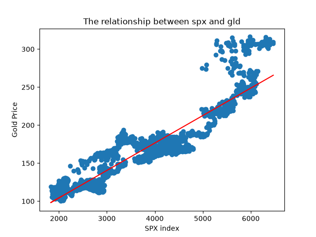
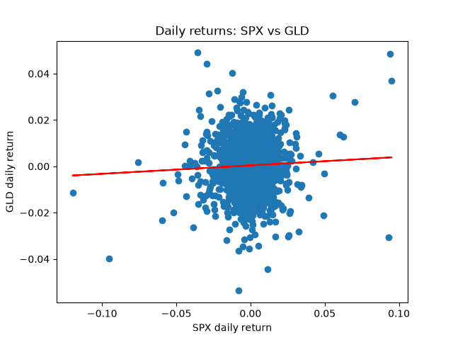
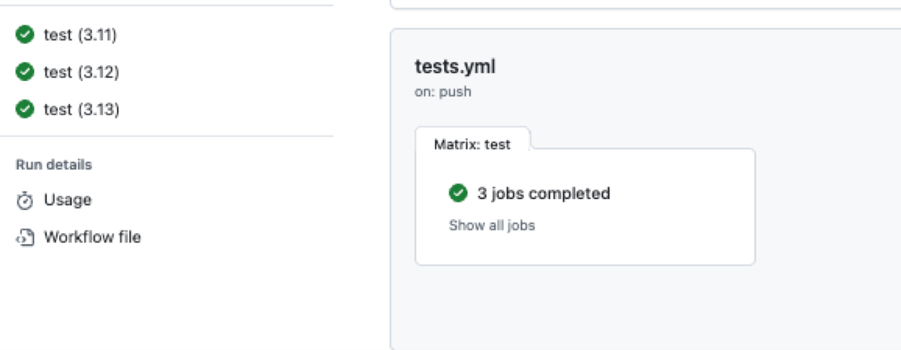
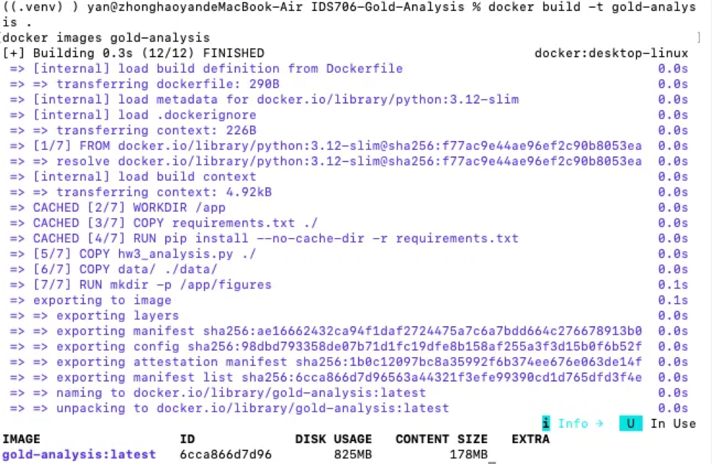
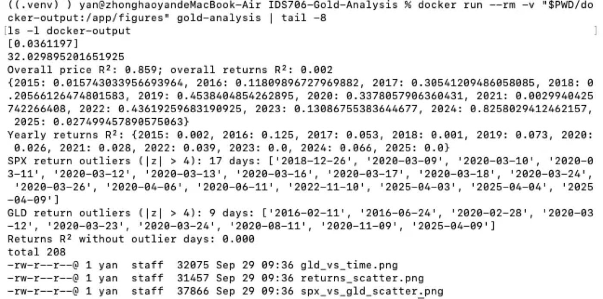
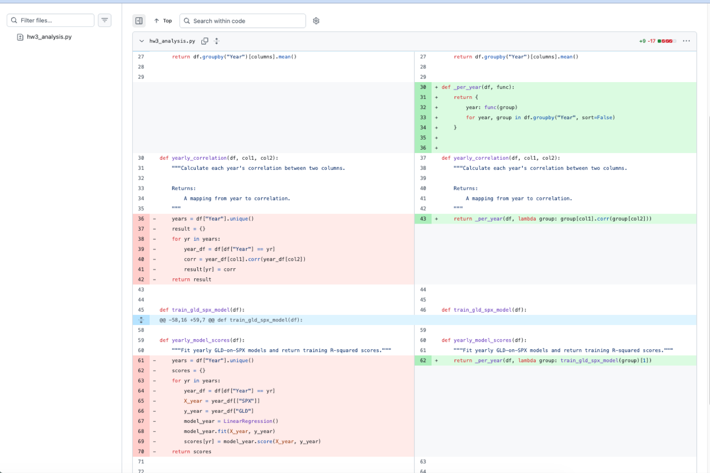

# Gold Price Relationship Analysis

[](https://github.com/Yan0309/IDS706-Gold-Analysis/actions/workflows/tests.yml)

## Problem

Gold is often treated as a hedge against stocks and the U.S. dollar. If GLD's
relationships with SPX and EUR/USD are not stable across the sample, an
investor relying on one overall correlation or R² could misjudge gold's
diversification value and make poor allocation decisions.

Does GLD have a stable relationship with EUR/USD and SPX from 2015-01-02 to
2025-08-14? The dataset contains 2,666 trading days. 2025 is a partial year,
ending August 14, which affects that year's averages and correlations.

## Data & Cleaning

- `Date` is parsed as datetime and `Year` is extracted for year-based analysis.
- `check_data_quality` reports 0 missing values and 0 duplicate rows.
- The regression raises `ValueError` when input contains NaN; it does not
  silently drop rows. This behavior is tested.
- Daily-return outliers are flagged when `|z| > 4`: 17 SPX days and 9 GLD days,
  clustered in March 2020 and April 2025. They are retained because they are
  real market events. Returns R² is 0.002 with outliers and 0.000 without,
  leaving the conclusion insensitive to them.

## Methods

- Calculate yearly average GLD prices and EUR/USD rates.
- Compare the overall GLD-EUR/USD correlation with correlations calculated
  separately by year.
- Fit linear regression models for SPX -> GLD using both prices and daily
  returns, reporting in-sample R² overall and by year.

## Key Findings

In an earlier version, I noticed that the price regression had a high overall
R² of 0.859, while the yearly R² values were mostly much lower, and I suspected
that shared long-term price trends were inflating the combined result. In this
version I tested that idea by refitting the same model on daily returns, where
the overall R² falls to 0.002 and yearly returns R² ranges from 0.000 to 0.125.
The result is consistent with the shared-trend explanation. It does not prove
causality, but it suggests that the high price R² reflects common trends more
than a stable day-to-day relationship.

- Overall GLD-EUR/USD correlation is -0.146, while yearly correlations are
  often strongly positive, a Simpson's-paradox-like pattern.
- Price R² is 0.859, compared with daily-returns R² of 0.002; yearly returns
  R² ranges from 0.000 to 0.125. The contrast is consistent with shared upward
  price trends producing a spurious-regression pattern.

 

## Setup & Usage

Requires Python 3.11 or newer.

```bash
python3 -m venv .venv
source .venv/bin/activate
pip install -r requirements-dev.txt
make check
python hw3_analysis.py
```

The script prints the analysis results and writes plots to `figures/`.

Optional tools:

- Pandas/Polars comparison: install with `pip install polars`, then run
  `python polars_comparison.py`.
- Rust notebook: install the `evcxr_jupyter` kernel with
  `cargo install evcxr_jupyter` and `evcxr_jupyter --install`, then open
  `notebooks/rust_vs_python_intro.ipynb` using the Rust kernel.

## Testing & CI

The suite has 33 pytest cases, including edge cases for empty data, missing
columns, unparseable dates, NaN, single-row years, plot output, and return
outliers. A seeded synthetic-data test demonstrates that shared trends can
inflate price R² while returns R² stays low.

`make check` runs `black --check`, `flake8`, and `pytest`, the same checks used
by CI. GitHub Actions tests Python 3.11, 3.12, and 3.13 on pushes to `main`,
pull requests, a weekly schedule, and manual dispatch.



## Docker

```bash
docker build -t gold-analysis .
docker run --rm -v "$PWD/docker-output:/app/figures" gold-analysis
```

The container writes analysis plots to the mounted `docker-output/` directory;
results match a local run.

### What I Learned

Building the container taught me that a Linux image has no display, so
matplotlib must run headlessly with `MPLBACKEND=Agg`. I also learned that files
created inside the container disappear with `--rm` unless a volume is mounted,
and that Docker layer ordering matters: after a code-only change, the
dependency install shows `CACHED` because `requirements.txt` is copied before
the script. The image is 825 MB, mostly from the scientific Python
dependencies, but the important payoff is reproducibility: the same script
produces matching analysis results in a fresh Linux container and on my Mac.





## Refactoring

### What I Changed

I extracted `_per_year(df, func)` so yearly grouping is implemented once. I
also reused `train_gld_spx_model` inside `yearly_model_scores` and converted
explanatory comments into docstrings.

### Why

Before, the loop over years was written twice, in `yearly_correlation` and
`yearly_model_scores`. That meant any change to yearly grouping or ordering
had to be made in two places and could drift; `yearly_model_scores` also
duplicated model-fitting logic instead of calling the existing training
function.

### How I Verified It

All 29 tests (at the time of the refactor) still passed. Because the tests only
check values, I also compared the final lines of the program's output before
and after the refactor. The only difference was that yearly dictionary keys
printed as Python `int` instead of `np.int32`; the numeric values were
identical, so I accepted the change and noted it in the commit message.

### How I Used AI and Where I Disagreed

- My initial refactoring plan (implemented by Copilot) added a
  `_fit_gld_spx_model` helper, but on review `train_gld_spx_model` only
  delegated to it. I had it removed because it added indirection without
  reducing complexity.
- In its refactoring audit, Copilot recommended extracting the shared
  Matplotlib boilerplate into a callback-based `_save_plot` helper and
  parameterizing the SPX/GLD column names. I rejected both: there were only
  two short plotting functions, and the project analyzes one variable pair, so
  the abstractions would add complexity without benefit. I later added
  optional plot labels only when the returns analysis created a real need.
- Copilot claimed that the plotting functions had no tests. I checked the test
  file with `grep` and found dedicated tests for both plotting functions, so I
  rejected that claim.
- Copilot once added tests with incorrect indentation, so pytest silently did
  not collect them; the suite still showed "12 passed". Copilot found this
  itself in a later turn. The lesson for me was that a green test run does not
  mean the tests actually ran, so I now check the collected test count.



## Limitations & Next Steps

- The dataset ends on 2025-08-14, so 2025 is only a partial year and its
  averages, correlations, and R² values are not directly comparable with full
  calendar years.
- The analysis examines only SPX and EUR/USD as relationships with GLD, even
  though inflation, interest rates, central-bank demand, and geopolitical
  events may also matter.
- R² is measured in-sample, the models are linear, and the results are
  correlational rather than causal; lagged and nonlinear relationships are not
  tested.
- Next step: use an Engle-Granger cointegration test to check for a stable
  long-run relationship, then test whether SPX returns lead GLD returns and
  add interest rates or inflation as additional variables.

## Files

- `hw3_analysis.py` - analysis functions, plots, and executable pipeline.
- `hw2_analysis.py` - original analysis script.
- `test_analysis.py` - unit, edge-case, synthetic-data, and pipeline tests.
- `data/gold_data_2015_25.csv` - daily market dataset.
- `figures/` - generated analysis plots.
- `polars_comparison.py` - Pandas and Polars timing comparison.
- `notebooks/rust_vs_python_intro.ipynb` - Rust/Python notebook.
- `Makefile`, `requirements*.txt`, and `Dockerfile` - local checks,
  dependencies, and container setup.
- `.github/workflows/tests.yml` - automated CI workflow.
- `docs/images/` - CI, Docker, and refactoring screenshots.
